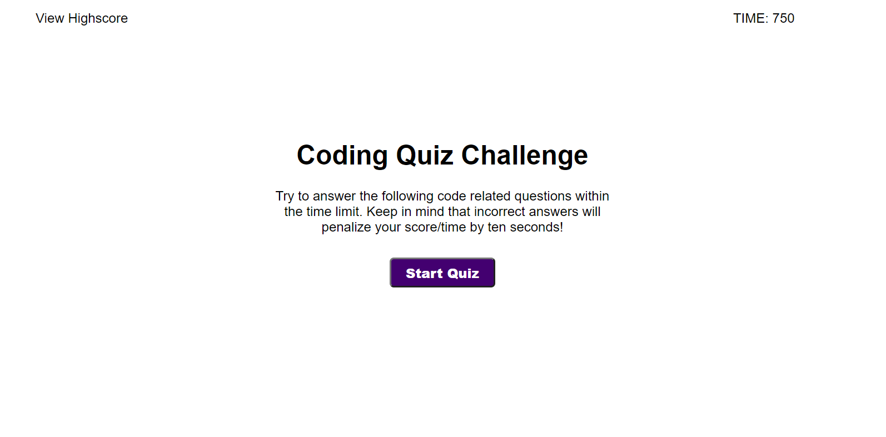

# Homework_04_Javascript_Quiz
Homework Assignment 04 - Due EOD 9/22/20214

The goal of this assignment was to deploy an application that is an interactive quiz that logs the users score and displays a high score board. The user should be docked points in the event taht they select the wrong answer. They should be prompted to submit their score to the scoreboard, and have the scoreboard be stored locally.

You can find the deployed applicatoin here: https://joshuakwatkins.github.io/Homework_04_Javascript_Quiz/

